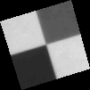
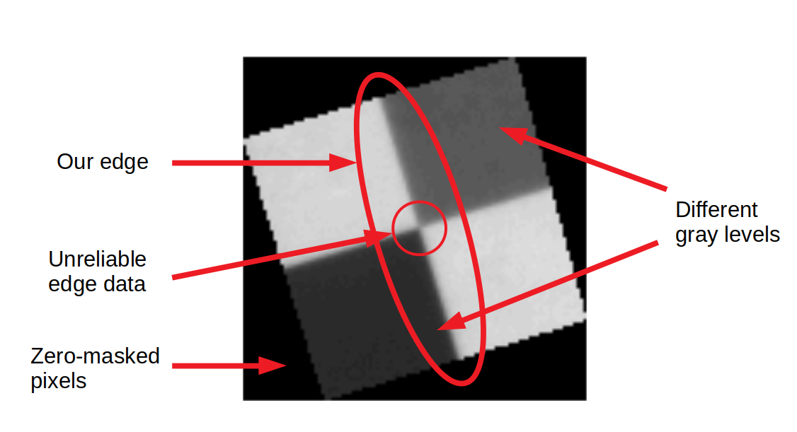
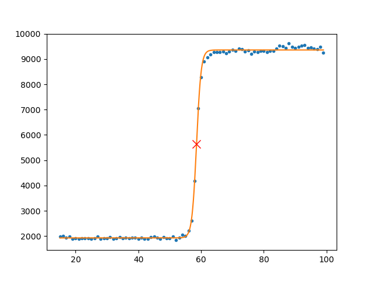
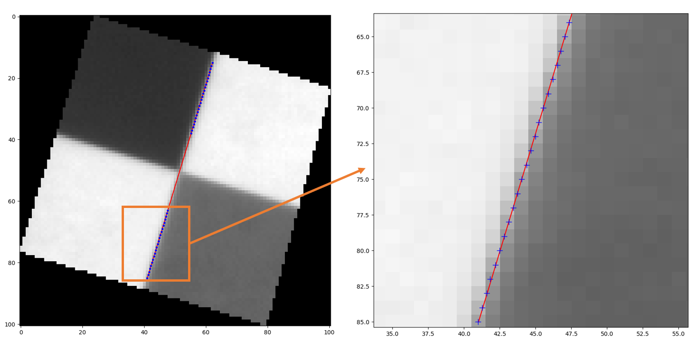
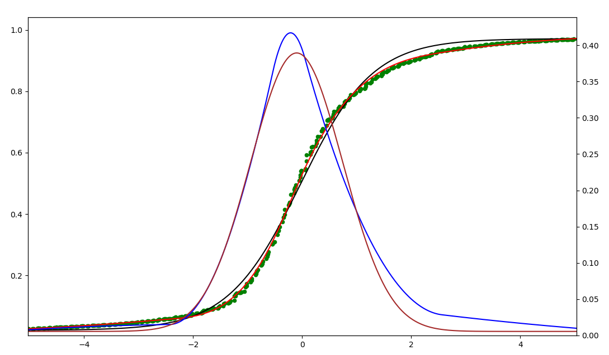
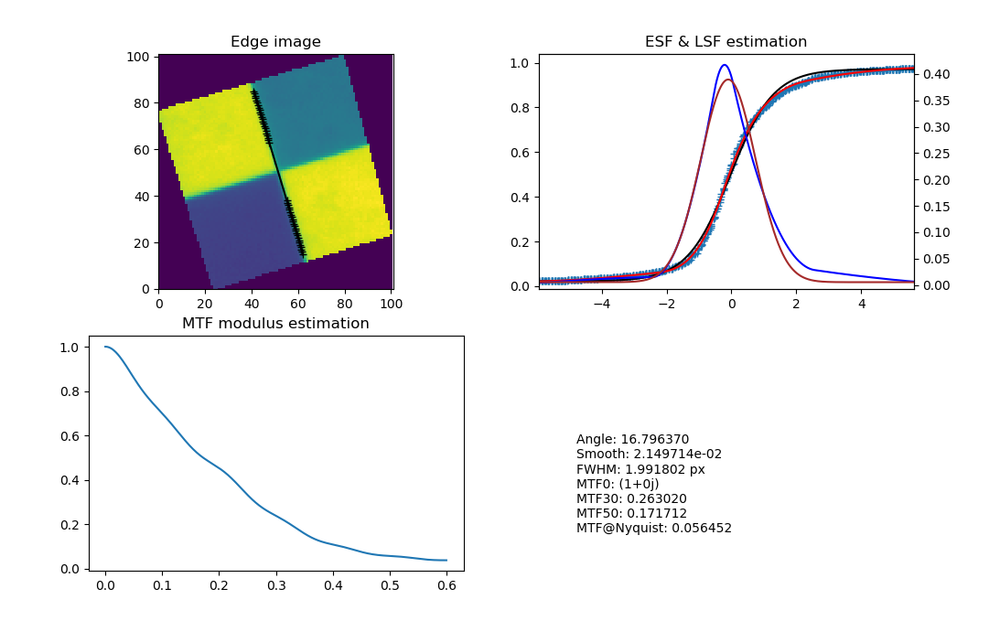
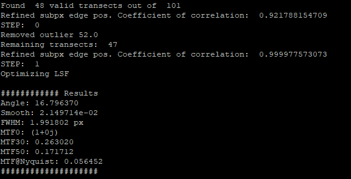

# FidMTF MTF Estimator
Robust ESF, PSF, FWHM &amp; MTF estimation from low-quality images and synthetic edge creation.

## Author's Notes

Estimating the MTF becomes difficult when the image is far from ideal, something that often happens with satellite data. I came up with the idea of using piecewise polynomials and optimization techniques to build a robust MTF estimator that doesn't rely on a given function and, being mostly numerical, is also more empiric.

Implementing this algorithm using Python and its numeric and scientific packages was a funny exercise. Surprisingly, it works pretty fine. I think it is robust, as expected, but it is also accurate. I validated it against third-party software. So it is maybe somewhat valuable. For this reason I've decided to open-source it using a GPLv3.0 license.

## Introduction

The Modulation Transfer Function (MTF) of an optical system represents the spatial frequency performance of such system. Its behaviour is directly related to the concepts of <i>sharpness, contrast</i> and <i>spatial resolution</i>. For this reason it is an important quality indicator, hence the need of an estimation method.
The MTF can be inferred from the optical system design but, unfortunately, in the real world only its modulus can be empirically determined or measured from the actual system.

One way to perform the estimation is to use actual images produced by the system. For example, the [ISO 12233](https://www.iso.org/standard/71696.html) provides an estimation standard focused on still picture cameras using [test charts](https://www.imatest.com/solutions/iso-12233/) or standardized targets. There are multiple ways of estimating the MTF using images, all of them based on the same idea: Extracting spatial frequency performance information beyond the discrete values that the image directly provides.

The <i>Slanted-Edge</i> methodology is an astute way of doing this. It uses a tilted knife-edge image and assumes that the transition between the two zones is straight and sharp in the object space. Under these assumptions it is then possible to estimate the sub-pixel position of the edge. Due to the knife-edge inclination it is then feasible to map multiple sub-pixel estimates that can be used to build a statistically robust model of the edge in the image space. This edge model can be immediately converted into a Point Spread Function (PSF) from which the MTF can be estimated.

## Algorithm Description

The algorithm implemented here is based on the slanted-edge sub-pixel sampling concept. I will describe it step by step following a real world example: An image acquired by an Earth-observation satellite on the <a href="https://calval.cr.usgs.gov/apps/baotou-comprehensive-calibration-and-validation-site">Baotou Comprehensive Calibration and Validation Site</a>.

<i>Baotou target</i>  

Currently the algorithm requires the pixels outside the target to be set to zero.
Note that the target has two dark areas with different gray levels. The algorithm will use both, automatically recognizing when the transition goes from bright to dark or vice-versa. Only the edge closest to the vertical will be used. There won't be enough pixels near the center to obtain a reliable edge model, those will be automatically discarded.

<i>Baotou features</i>  

The algorithm will also work with simple edge images.

### First Edge Position Estimation

The <i>Transect</i> class represents an image row. It contains the method needed to estimate the sub-pixel position of the edge in the represented row. For robustness the class requires a minimum number of data pixels in total and around the edge to be valid (<i>__isValid</i>).

The row data is first smoothed and then differentiated to obtain a coarse estimation of the pixel position of the edge. The estimation is used later to set the initial conditions of the optimization that fits a [Sigmoid function](https://en.wikipedia.org/wiki/Sigmoid_function) to the data. The optimization technique used allows you to easily set a different function if you are not comfortable with the Sigmoid modelling the Edge Spread Function (ESF). It is worth noting that <b>the Sigmoid won't be used for the MTF calculation</b>, it is only used for the estimation of the sub-pixel edge position.

The optimization yields the function parameters, allowing us to work in a continuous domain. From here it is trivial to obtain the function derivative (Line Spread Function, LSF) and its inflection point, which corresponds to the estimated sub-pixel position of the edge.

<i>Sigmoid fitted to row data in a specific Transect. The red marker shows the estimated sub-pixel edge position. Circles are pixel values.</i>  

### The MTF Class

When instantiated, the class scans the image row by row creating transect instances. If the edge detection is not good enough (short transect, unreliable edge data, etc.) the transects are labeled as invalid and no longer used.

The method <i>refineEdgeSubPx()</i> performs a linear regression in order to check if the centers arrangement is straight as assumed. Outliers are removed during this process. The second run of this method allows the estimation of the edge angle.

<i>Estimated sub-pixel edge locations of valid transects. The resulting line of the linear regression is shown in red</i>  

#### Definitive Edge Location

Each transect has a sub-pixel edge position estimated using a function fitting. It has served its purpose and won't be used any longer. <b>The definitive sub-pixel edge position of each transect is now defined by the resulting line of the second iteration of the linear regression (<i>refineEdgeSubPx()</i>, outliers removed)</b>.

#### ESF and PSF Estimation

The sub-pixel edge position is used to shift each transect to a common origin, hence creating a supersampled virtual edge. This way, instead of using the Sigmoid or other function, <b>the edge is modelled as a spline</b>, creating a numeric and more realistic representation of the ESF. <b>The PSF is obtained by fitting the spline shape to a Gaussian function using a Levenberg-Marquardt optimization</b>(<i>calcOptimizedLsf</i>).

<i>Green: Supersampled edge 
Brown: Best-fit Gaussian resulting from the optimization 
Red: Optimized ESF spline numeric model 
Blue: Optimized PSF spline numeric model
</i>  

### MTF Estimation

The MTF is now straightforward to calculate from the optimized PSF numeric model using the real and discrete fast Fourier transform implemented in the NumPy package.

The results are provided through a Matplotlib interactive widget with additional information on the console.

<i>Matplotlib output example</i>  
 

<i>Console output example</i>  

## The Edge Class

This class is intended for validation purposes. You can use it to create perfect synthetic edges for performance comparison with third-party software.

<i>Synthetic edge sample</i>  

## Validation

The algorithm and its implementation has been validated using synthetic edges and actual edges using third-party software.

## Installing and Using as a QGIS Plugin

Check the [instructions](README.md).

