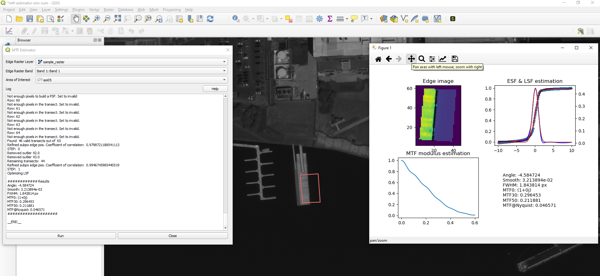
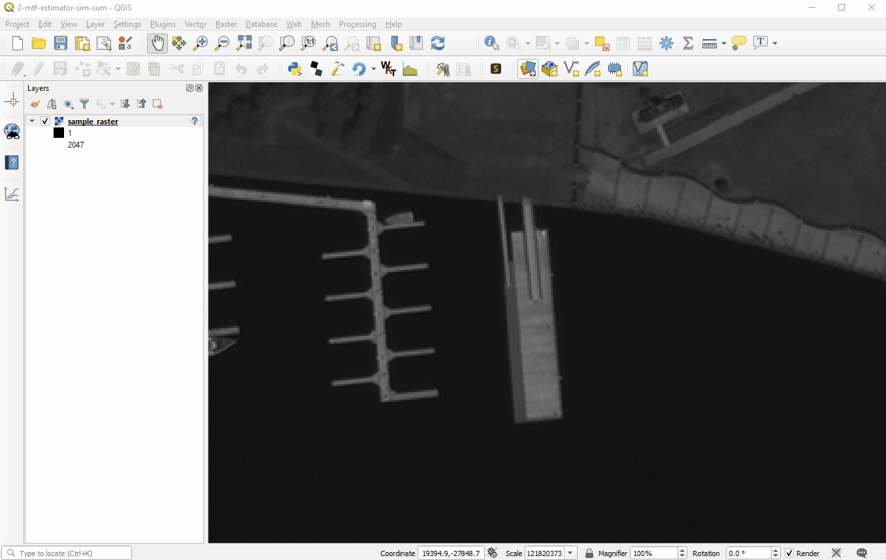

# MTF Estimator
Robust ESF, PSF, FWHM &amp; MTF estimation from low-quality images and synthetic edge creation.

It is recommendable to read the [algorithm description](Algorithm_Description.md) first.

## QGIS Plugin

To improve its usability I've integrated the algorithm in a QGIS Plugin. In order to use it you will need QGIS 3.10 or higher.

### Installation

You can use the [QGIS Plugin Manager](https://docs.qgis.org/3.10/en/docs/training_manual/qgis_plugins/fetching_plugins.html). Use <i>Plugins -> Manage and Install Plugins -> All</i> to search and install install the package. 
Once installed, the <i>MTF Estimator</i> option will be available in the <i>Plugins</i> menu.

### Usage

* Load the study image  
Remote rasters (WMS, Tile Server) are not supported 
Check that the image is projected to a regular grid or has no geolocation information at all. Geolocation based on RPCs or GCPs is not supported. If your image is geolocated this way, a workaround is just to remove the geolocation metadata. 

* Load or create a vector layer containing the polygon that defines the area of interest. Once drawn don't forget to save it 

* Open <i>MTF Estimator</i> from the <i>Plugins</i> menu 

* Select the study image and band 

* Select vector layer 

* Run the algorithm 
It may take some time. During the time that the task requires the dialog window will be unresponsive. This is definitely something to improve for future versions. 
Once the process is completed a log will be shown. If there was enough data with sufficient quality a results window will appear. 

* Examine the outputs 
The results window has its own toolbar containing pan, zoom, and save tools. Additional data can be found in the log window.

### Obtaining Successful Results

* It is advisable to read the [algorithm description](Algorithm_Description.md) first.
* The edge must be straight and sharp. A man-made target is more likely to have these features.
* The high and low reflectance surfaces near the edges must be uniform.
* Remember that the algorithm works with vertical edges. Its angle is important. If you need estimations <i>along</i> just transpose (or rotate) the image.

### Contributing and Bug Reporting

* If you wish to contribute patches you can fork the project, make your changes, commit to your repository, and then create a pull request. 
* You can report bugs as [issues](https://github.com/JorgeGIlG/MTF_Estimator/issues)

### Contact

Contact me on [Linkedin](https://es.linkedin.com/in/jorge-gil-10453069)

