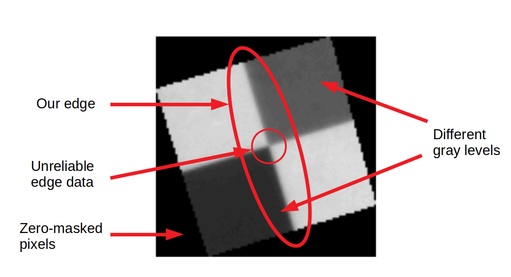

# MTF_Estimator
Robust ESF, PSF, FWHM &amp; MTF estimation from low quality images.

## Introduction

The Modulation Transfer Function (MTF) of an optical system represents the spatial frequency performance of such system. Its behaviour is directly related to the concepts of <i>sharpness, contrast</i> and <i>spatial resolution</i>. For this reason it is an important quality indicator, hence the need of an estimation method.
The MTF can be inferred from the optical system design but, unfortunately, in the real world only its modulus can be empirically determined or measured from the actual system.

One way to perform the estimation is to use actual images produced by the system. For example, the [ISO 12233](https://www.iso.org/standard/71696.html) provides an estimation standard focused on still picture cameras using [test charts](https://www.imatest.com/solutions/iso-12233/) or standarized targets. There are multiple ways of estimating the MTF using images, all of them based on the same idea: Extracting spatial frequency performance information beyond the discrete values that the image directly provides.

The <i>Slanted-Edge</i> methodology is an astute way of doing this. It uses a tilted knife-edge image and assumes that the transition between the two zones is straight and sharp in the object space. Under these assumptions it is then possible to estimate the sub-pixel position of the edge. Due to the knife-edge inclination it is then feasible to map multiple sub-pixel estimates that can be used to build a statistically robust model of the edge in the image space. This edge model can be immediately converted into a Point Spread Function (PSF) from which the MTF can be estimated.

## Algorithm Description

The algorithm implemented here is based on the slanted-edge sub-pixel sampling concept. I will describe it step by step following a real world example: An image acquired by an Earth-observation satellite on the <a href="https://calval.cr.usgs.gov/apps/baotou-comprehensive-calibration-and-validation-site">Baotou Comprehensive Calibration and Validation Site</a>.

_Baotou target_ 

Currently the algorithm requires the pixels outside the target to be set to zero.
Note that the target has two dark areas with different gray levels. The algorithm will use both, automatically recognizing when the transition goes from bright to dark or vice-versa. Only the edge closest to the vertical will be used. There won't be enough pixels near the center to obtain a reliable edge model, those will be automatically discarded.

*Baotou features* 

